Desenvolvedor de software na Skeps. Faço APIs em C# e TypeScript, chatbots na plataforma Blip e agentes de IA, e integro tudo isso aos sistemas e CRMs dos clientes. Fora do trabalho, aprofundo Python (FastAPI e Flask) e backend com projetos próprios.

## Projetos pessoais

<table>
<tr>
<td width="50%" valign="top">

</td>
<td width="50%" valign="top">

### [HelpDeskFlow](https://github.com/Rianzzz/helpdeskflow)

Sistema de chamados de suporte para várias empresas, em quatro serviços .NET que conversam por eventos no RabbitMQ. Front-end em React, notificações em tempo real e deploy em Kubernetes.

Mais de 300 testes rodam no CI a cada push.

`C#` `.NET 9` `PostgreSQL` `RabbitMQ` `SignalR` `React` `Kubernetes`

</td>
</tr>
<tr>
<td width="50%" valign="top">

</td>
<td width="50%" valign="top">

### [Integration Hub API](https://github.com/Rianzzz/integration-hub-api)

Recebe dados de clientes de sistemas diferentes, converte tudo para um formato só e guarda no PostgreSQL. Cada origem tem o seu adapter.

Feita com uma funcionalidade por commit.

`Python` `FastAPI` `SQLAlchemy` `PostgreSQL` `Docker` `pytest`

</td>
</tr>
</table>

## Tecnologias

As imagens desta página são geradas por [`tools/generate_assets.py`](tools/generate_assets.py).
